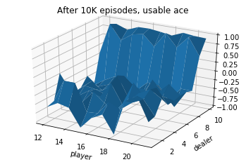
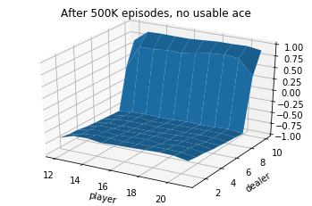

# Reinforcement Learning

This repository contains code for several Reinforcement Learning projects. Topics include Dynamic Programming, Temporal Difference (TD) and Deep Q Learning (DQN) Networks. 

## Lab 1: Dynamic Programming

In this exercise we will evaluate a policy and find the value function. We evaluate this using Dynamic Programming. Using the policy evaluation algorithm we can implement policy iteration to find a good policy for this problem. In this exercise we will implement the value iteration algorithm with Q-values.

## Lab 2: Monte Carlo

For the Monte Carlo Prediction we will look at the Blackjack game, Example 5.1 from the book "Reinforcement Learning: An introduction" by Richard S. Sutton and Andrew G. Barto. The `BlackjackEnv` is implemented in `blackjack.py`. We implement the MC prediction algorithm and make plots following the book. 

In the second part of this exercise we will use off-policy monte carlo to estimate the value function of our target policy using the experience from a different behavior policy.

  

  

Monte Carlo Prediction with the Blackjack game.

## Lab 3: Temporal Difference (TD)

This part of the project is about Temporal Difference (TD). In this lab, we use the windy gridworld environment, Example 6.5 from the book "Reinforcement Learning: An introduction" by Richard S. Sutton and Andrew G. Barto.

## Lab 4: Deep Q Learning (DQN)

In this lab, we use [PyTorch](https://pytorch.org/) to imlement a Deep Q-Network. We implement the `QNetwork.forward` function that uses one hidden layer with ReLU activation (no output activation).

---

### Acknowledgements

These projects are from the Reinforcement Learning Course from the Master Artificial Intelligence at the University of Amsterdam in the Fall of 2020.